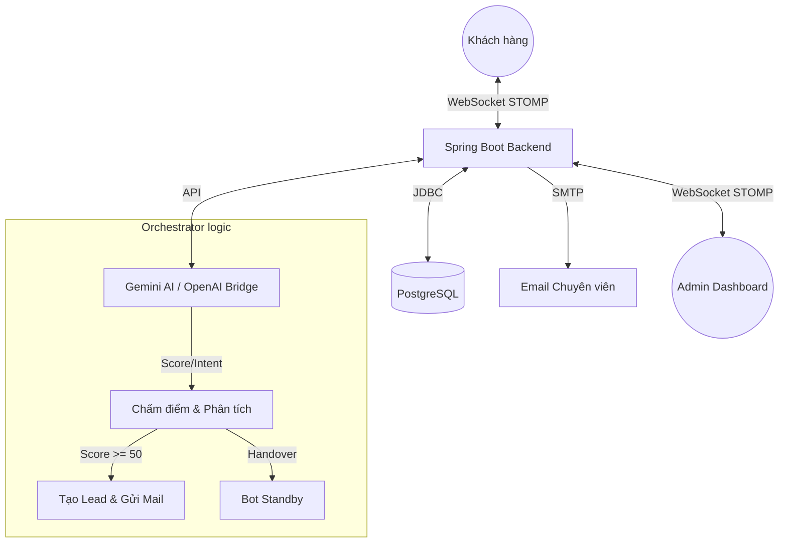

# SMARTAGENT HYBRID SUPPORT 🤖💻

**SmartAgent** là nền tảng hỗ trợ khách hàng Hybrid (Kết hợp AI & Chuyên viên), tối ưu cho các **Công ty Phát triển Phần mềm và Dịch vụ IT**. Hệ thống sử dụng Trí tuệ nhân tạo (Gemini AI) để tư vấn giải pháp sơ bộ, sàng lọc nhu cầu dự án và chuyển giao cho Chuyên viên tư vấn ngay khi phát hiện khách hàng có nhu cầu phát triển phần mềm cụ thể.

---

## 🚀 Các Tính Năng Đột Phá

### 🎯 Tư Vấn Giải Pháp AI (AI Solution Consultancy)
AI không chỉ trả lời tự động mà còn đóng vai trò là một **Chuyên viên tư vấn kỹ thuật sơ bộ**:
- **Project Scoring**: Đánh giá mức độ tiềm năng của dự án dựa trên yêu cầu tính năng, công nghệ và ngân sách mà khách hàng đề cập.
- **Auto Lead Capture**: Khi phát hiện nhu cầu xây dựng phần mềm rõ ràng, Bot tự động hiển thị **Mini Contact Form** để thu thập thông tin liên hệ để có thể yêu cầu chuyên viên tư vấn chuyên sâu

### 📧 Thông Báo Dự Án (Project Notification)
Đảm bảo Chuyên viên tư vấn/Project Manager không bỏ lỡ yêu cầu từ khách hàng:
- **Instant Email Alert**: Gửi email thông báo ngay khi khách hàng gửi yêu cầu tư vấn dự án.
- **AI Conversation Summary**: AI tóm tắt toàn bộ yêu cầu kỹ thuật của khách, giúp Chuyên viên nắm bắt "đề bài" chỉ trong vài giây trước khi vào trao đổi chi tiết.
- **Direct Workspace Link**: Truy cập thẳng vào phòng chat quản trị từ email để có thể theo dõi cuộc trò chuyện của chat bot và khách hàng.

### 🖥️ Dashboard Giám Sát & Quản Lý (Hybrid Monitoring)
Giao diện giúp nhân viên theo dõi sát sao mọi tương tác giữa AI và Khách hàng:
- **Smart Inbox**: Tự động phân loại và ưu tiên các phiên chat cần sự can thiệp của con người (như khi Bot đã thu thập xong contact hoặc khách hàng có yêu cầu phức tạp).
- **2-Column Layout**: Thiết kế tập trung giúp nhân viên vừa giám sát được luồng tư vấn tự động của Bot, vừa có thể sẵn sàng giành quyền (Take Over) để chat trực tiếp khi cần.
- **Realtime Monitoring**: Theo dõi tin nhắn giữa Bot và Khách hàng theo thời gian thực, đảm bảo tính minh bạch và chất lượng tư vấn của hệ thống AI.

---

## 🛠️ Công Nghệ Sử Dụng

### Backend (Spring Boot)
- **Java 17 / Spring Boot 3.4**
- **Spring AI**: Tích hợp Gemini AI để xử lý ngôn ngữ tự nhiên và tóm tắt yêu cầu.
- **Spring Mail**: Tự động hóa quy trình thông báo qua Email.
- **WebSocket STOMP**: Đảm bảo trải nghiệm tư vấn realtime mượt mà.
- **PostgreSQL**: Lưu trữ dữ liệu dự án, khách hàng và lịch sử tư vấn.
- **Flyway**: Quản lý các thay đổi cấu trúc database (migrations).

### Frontend (React)
- **Vite + React.js**
- **Tailwind CSS**: UI hiện đại, tập trung vào trải nghiệm người dùng (UX).
- **Lucide React**: Hệ thống Icon trực quan.

---

## 🏛️ Kiến Trúc Hệ Thống (System Architecture)

Hệ thống hoạt động theo mô hình **Hybrid Support** (Người + AI) dựa trên cơ chế hướng sự kiện:



### Quy trình hoạt động:
1.  **Giao tiếp**: Khách hàng tương tác qua WebSocket (STOMP) để đảm bảo tính thời gian thực.
2.  **Phân tích (Orchestrator)**: Mỗi tin nhắn được AI phân tích để chấm điểm tiềm năng (Lead Score) và nhận diện ý định (Intent).
3.  **Xử lý Lead**: Nếu điểm > 50, hệ thống yêu cầu thông tin liên hệ, lưu vào database và gửi email thông báo ngay cho chuyên viên.
4.  **Can thiệp (Take Over)**: Chuyên viên theo dõi Dashboard và có thể ngắt Bot để chat trực tiếp bất cứ lúc nào.

---

## 📂 Cấu Trúc Dự Án (Project Structure)

```text
SMARTAGENT/
├── client/                # Frontend React application (Vite)
│   ├── src/
│   │   ├── components/    # Landing Page, Chat Widget, Admin Dashboard
│   │   ├── services/      # Logic kết nối API & WebSocket
│   │   └── assets/        # CSS, hình ảnh, tài nguyên tĩnh
├── spring-server/         # Backend Spring Boot application
│   ├── src/main/java/.../
│   │   ├── chat/          # Logic Chat (Controller, Service, Entity)
│   │   ├── orchestrator/  # "Bộ não" AI, Chấm điểm, Xử lý Lead
│   │   ├── notification/  # Logic gửi thông báo Email
│   │   └── config/        # Cấu hình CORS, WebSocket, Security
│   ├── src/main/resources/
│   │   ├── db/migration/  # Flyway SQL (V1, V2 schema)
│   │   └── templates/     # Template Email Thymeleaf
├── docs/                  # Tài liệu hướng dẫn & System Prompt
├── memory-bank/           # Hệ thống Single Source of Truth cho AI context
└── docker-compose.yml     # File điều phối Docker (DB, App, Client)
```

---

## 📦 Hướng Dẫn Cài Đặt

### 1. Yêu Cầu Hệ Thống
- JDK 17+
- Node.js 18+
- PostgreSQL 15+

### 2. Cấu Hình Environment
Tạo file `.env` tại thư mục gốc dựa trên mẫu `.env.example`:
```bash
cp .env.example .env
```
Cần chuẩn bị các thông tin sau:
- `GEMINI_KEY`: API Key để sử dụng Gemini
- `MAIL_USERNAME` / `MAIL_PASSWORD`: Tài khoản Gmail SMTP (sử dụng App Password).
- `AGENT_EMAIL`: Địa chỉ email nhận thông báo lead.
- `DB_NAME`: Tên database
- `DB_USER`: Username database
- `DB_PASSWORD`: Password database

### 3. Chạy Dự Án

#### Cách 1: Sử dụng Docker (Khuyên dùng)
Hệ thống đã được đóng gói hoàn chỉnh bằng Docker. Bạn chỉ cần 1 câu lệnh:
```bash
docker-compose up --build
```
*Lưu ý: Đảm bảo bạn đã điền các biến môi trường vào file `.env` hoặc truyền trực tiếp trước khi chạy.*

#### Cách 2: Chạy Thủ Công (Development)
**Backend:**
```bash
cd spring-server
./mvnw spring-boot:run
```

**Frontend:**
```bash
cd client
npm install
npm run dev
```

---

## 📈 Giá Trị Mang Lại
- **Tăng Tỉ Lệ Chốt Đơn**: Kết nối nhân viên với khách hàng đúng thời điểm "vàng".
- **Tiết Kiệm Chi Phí**: AI xử lý 70-80% các câu hỏi lặp đi lặp lại.
- **Chuyên Nghiệp Hóa**: Phản hồi khách hàng tức thì với sự hỗ trợ của trợ lý AI.

---
© 2024 SmartAgent Team - Build for Sales Excellence.
