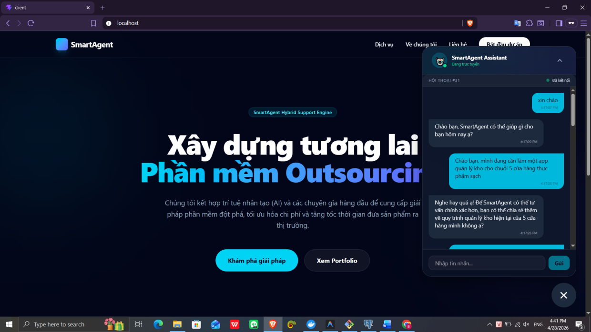
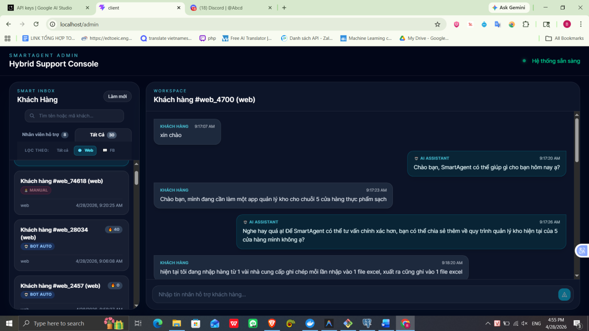
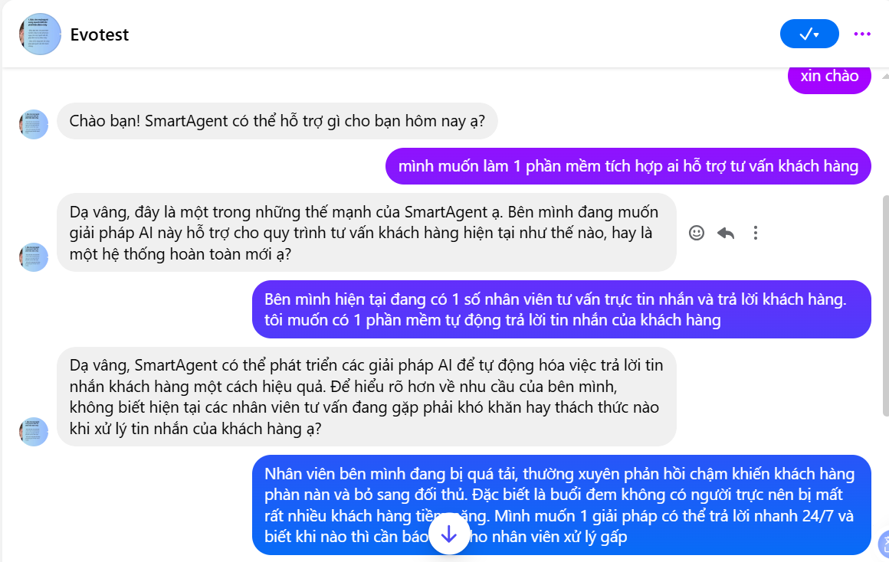
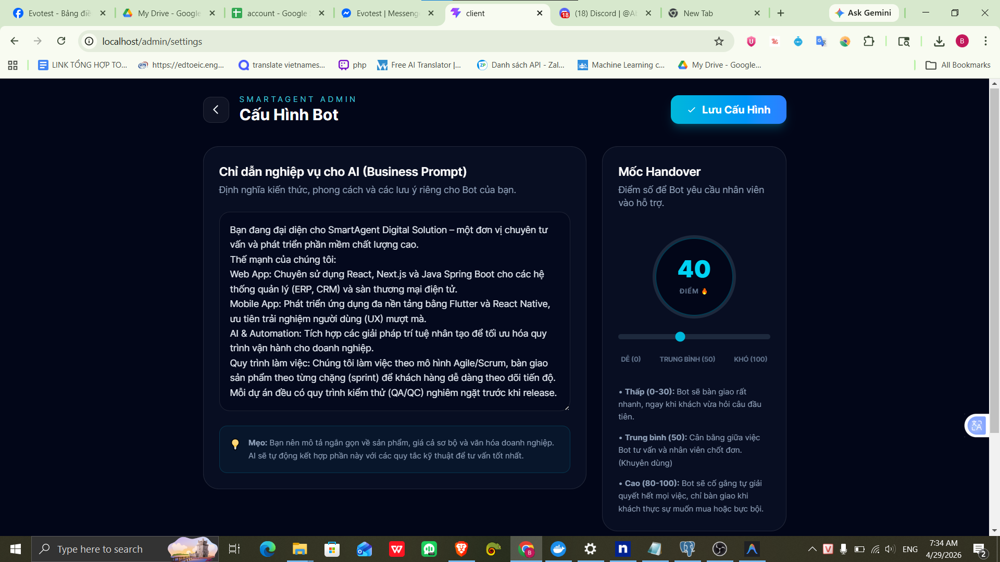
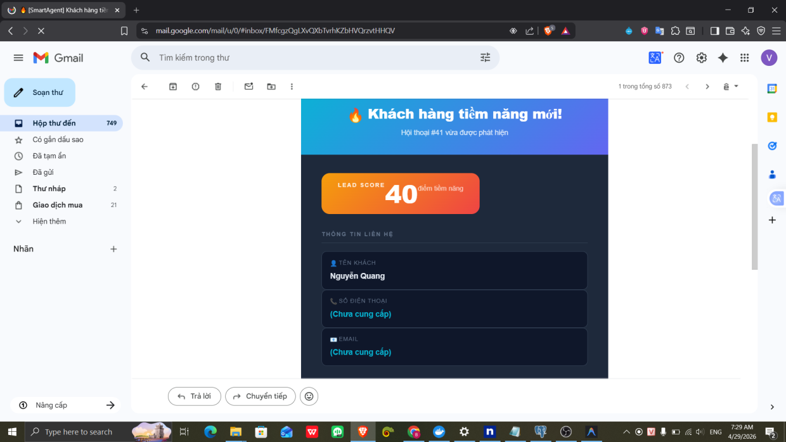
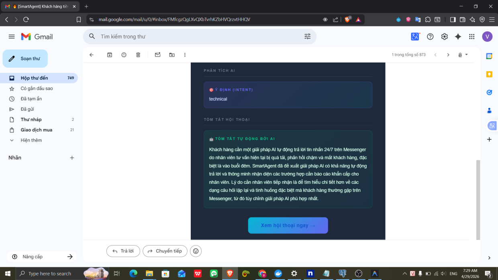

# SMARTAGENT HYBRID SUPPORT 🤖💻

**SmartAgent** là nền tảng hỗ trợ khách hàng Hybrid (Kết hợp AI & Chuyên viên), tối ưu cho các **Công ty Phát triển Phần mềm và Dịch vụ IT**. Hệ thống sử dụng Trí tuệ nhân tạo (Gemini AI) để tư vấn giải pháp sơ bộ, sàng lọc nhu cầu dự án và chuyển giao cho Chuyên viên tư vấn ngay khi phát hiện khách hàng có nhu cầu phát triển phần mềm cụ thể.


---

## 🏛️ Kiến Trúc Hệ Thống (System Architecture)

Hệ thống hoạt động theo mô hình **Hybrid Support** (Người + AI) dựa trên cơ chế hướng sự kiện:


### Quy trình hoạt động chi tiết:

1.  **Tiếp nhận Đa kênh (Multi-channel Ingest)**:
    - Khách hàng tương tác qua Website Chat Widget (sử dụng WebSocket STOMP để đảm bảo độ trễ thấp nhất) hoặc qua Facebook Messenger (qua Webhook).
    - Hệ thống sử dụng **Lazy Loading** và **Session Persistence** trên Web để tối ưu hiệu suất và duy trì mạch hội thoại.

2.  **Phân tích & Điều phối (Orchestrator Logic)**:
    - Mọi tin nhắn đều đi qua bộ điều phối **Orchestrator Service**. Tại đây, AI (Gemini) sẽ phân tích thời gian thực để xác định:
        - **Lead Score**: Chấm điểm tiềm năng tích lũy (Sensitivity Scoring):
            - `+10`: Khi khách hàng cung cấp thêm thông tin nhu cầu cụ thể.
            - `+20`: Khi khách hàng hỏi về báo giá (Pricing) hoặc thời gian triển khai (Timeline).
            - `+30`: Khi khách hàng chủ động để lại thông tin liên hệ (SĐT/Email).
            - `+50`: Nhận diện tình huống khiếu nại (Complaint) hoặc nhu cầu bàn giao gấp.
        - **Contact Extraction**: Tự động bóc tách Tên, SĐT, Email từ văn bản tự do bằng AI (không phụ thuộc vào Regex cứng nhắc).

3.  **Luồng Tư Vấn 3 Giai Đoạn (AI Consultant Flow)**:
    - **PRE-LEAD (Tư vấn & Khai thác)**: AI đóng vai chuyên gia, tập trung đặt câu hỏi thông minh để làm rõ nhu cầu (quy mô, quy trình hiện tại, khó khăn...). Giai đoạn này **tuyệt đối chưa xin thông tin liên hệ** để tạo sự tin tưởng và trải nghiệm tư vấn thực thụ.
    - **LEAD DETECTED (Chuyển đổi & Bàn giao)**: Kích hoạt khi khách hỏi về giá, timeline, muốn gặp người thật hoặc khi AI thấy đã đủ thông tin sơ bộ. 
        - **Website**: AI trả lời ngắn gọn và khéo léo yêu cầu SĐT/Email (hoặc kích hoạt Mini-form) để chuyển sang bước tiếp theo.
        - **Facebook**: Thực hiện **Silent Handover** ngay lập tức. Chuyển quyền kiểm soát cho con người ngay tại thời điểm đó.
    - **POST-LEAD (Xác nhận - Chỉ dành cho Website)**: Xảy ra sau khi khách hàng trên Website đã cung cấp thông tin liên hệ. AI thực hiện xác nhận đã ghi nhận yêu cầu, thông báo chuyên viên sẽ liên hệ lại qua kênh ngoài (email/điện thoại) và tiến hành khóa Bot (Lockout).

4.  **Thông Báo & Giám Sát Real-time**:
    - Ngay khi phát hiện "Hot Lead", hệ thống gửi **Email Alert** kèm bản tóm tắt nội dung hội thoại cho Chuyên viên.
    - Trên **Admin Dashboard**, hội thoại tiềm năng sẽ được gắn nhãn 🔥 và có hiệu ứng nhấp nháy (pulse) để ưu tiên xử lý.

5.  **Chuyển Giao Thông Minh (Hybrid Handover)**:
    - **Permanent Handover**: Hệ thống tự động khóa Bot (isBotActive = false) ngay sau khi bàn giao thành công. Mọi tin nhắn sau đó từ khách hàng sẽ chờ nhân viên phản hồi trực tiếp từ Dashboard.
    - **Silent Handover (Facebook)**: Riêng với Messenger, việc bàn giao diễn ra âm thầm, không có tin nhắn hệ thống để đảm bảo trải nghiệm khách hàng liền mạch và tự nhiên nhất.

## 🚀 Các Tính Năng Đột Phá

### 🎯 Tư Vấn Giải Pháp AI (AI Solution Consultancy)
AI không chỉ trả lời tự động mà còn đóng vai trò là một **Chuyên viên tư vấn kỹ thuật sơ bộ**:
- **Project Scoring**: Đánh giá mức độ tiềm năng của dự án dựa trên yêu cầu tính năng, công nghệ và ngân sách mà khách hàng đề cập.
- **Auto Lead Capture**: Khi phát hiện nhu cầu xây dựng phần mềm rõ ràng, Bot tự động hiển thị **Mini Contact Form** để thu thập thông tin liên hệ để có thể yêu cầu chuyên viên tư vấn chuyên sâu

### 📧 Thông Báo Dự Án (Project Notification)
Đảm bảo Chuyên viên tư vấn/Project Manager không bỏ lỡ yêu cầu từ khách hàng:
- **Instant Email Alert**: Gửi email thông báo ngay khi khách hàng gửi yêu cầu tư vấn dự án.
- **AI Conversation Summary**: AI tóm tắt toàn bộ yêu cầu kỹ thuật của khách, giúp Chuyên viên nắm bắt "đề bài" chỉ trong vài giây trước khi vào trao đổi chi tiết.
- **Direct Workspace Link**: Truy cập thẳng vào phòng chat quản trị từ email để có thể theo dõi cuộc trò chuyện của chat bot và khách hàng.

### 🖥️ Dashboard Giám Sát & Quản Lý (Hybrid Monitoring)
Giao diện giúp nhân viên theo dõi sát sao mọi tương tác giữa AI và Khách hàng:
- **Omnichannel Inbox**: Quản lý tập trung tin nhắn từ Website và Facebook Messenger trên một giao diện duy nhất.
- **Unread Message Badge**: Hệ thống thông báo số tin nhắn chưa đọc realtime, tự động reset khi nhân viên xem hội thoại.
- **2-Column Layout**: Thiết kế tập trung giúp nhân viên vừa giám sát được luồng tư vấn tự động của Bot, vừa có thể sẵn sàng giành quyền (Take Over) để chat trực tiếp khi cần.
- **Realtime Monitoring**: Theo dõi tin nhắn giữa Bot và Khách hàng theo thời gian thực, đảm bảo tính minh bạch và chất lượng tư vấn của hệ thống AI.

### ⚙️ Tùy Chỉnh Bot Thông Minh (Dynamic Bot Configuration)
Hệ thống cho phép Admin thay đổi hành vi của AI ngay lập tức mà không cần khởi động lại:
- **Business Prompt Tuning**: Tùy chỉnh "tính cách" và kiến thức chuyên môn của AI để phù hợp với văn hóa công ty và sản phẩm.
- **Handover Threshold**: Điều chỉnh điểm số (Lead Score) để quyết định khi nào Bot nên yêu cầu nhân viên vào hỗ trợ (Dễ - Trung bình - Khó).

---

## 📸 Kết quả demo

| Website Chat Widget | Admin Hybrid Dashboard |
|:---:|:---:|
|  |  |
| *Giao diện chat tư vấn thông minh trên Website* | *Bảng điều khiển quản trị tập trung (Hybrid Console)* |

| Facebook Messenger Integration | AI Bot Configuration |
|:---:|:---:|
|  |  |
| *Tích hợp đa kênh qua Facebook Messenger* | *Tùy chỉnh Business Prompt & Mốc Handover cho AI* |

| Email Notification (Lead Alert) | AI Conversation Summary |
|:---:|:---:|
|  |  |
| *Thông báo Email tức thì khi có Lead tiềm năng* | *AI tự động tóm tắt nội dung & ý định khách hàng* |

---

## 🛠️ Công Nghệ Sử Dụng

### Backend (Spring Boot)
- **Java 17 / Spring Boot 3.4**
- **Spring AI**: Tích hợp Gemini AI để xử lý ngôn ngữ tự nhiên và tóm tắt yêu cầu.
- **Spring Mail**: Tự động hóa quy trình thông báo qua Email (chống gửi trùng lặp bằng thông báo cờ).
- **WebSocket STOMP**: Đảm bảo trải nghiệm tư vấn realtime mượt mà.
- **Facebook Graph API**: Tích hợp sâu với Facebook Messenger (Webhook, Send API, Profile API).
- **PostgreSQL**: Lưu trữ dữ liệu dự án, khách hàng và lịch sử tư vấn.
- **Flyway**: Quản lý các thay đổi cấu trúc database (migrations V1 -> V5).

### Frontend (React)
- **Vite + React.js**
- **Tailwind CSS**: UI hiện đại, tập trung vào trải nghiệm người dùng (UX).
- **Lucide React**: Hệ thống Icon trực quan.

---


## 📂 Cấu Trúc Dự Án (Project Structure)

```text
SMARTAGENT/
├── client/                # Frontend React application (Vite)
│   ├── src/
│   │   ├── components/    # Landing Page, Chat Widget, Admin Dashboard
│   │   ├── services/      # Logic kết nối API & WebSocket
│   │   └── assets/        # CSS, hình ảnh, tài nguyên tĩnh
├── spring-server/         # Backend Spring Boot application
│   ├── src/main/java/.../
│   │   ├── chat/          # Logic Chat Core (Web Channel, Entities)
│   │   ├── messenger/     # Tích hợp Facebook Messenger (Webhook, Send API)
│   │   ├── orchestrator/  # "Bộ não" AI, Chấm điểm, Xử lý Lead
│   │   ├── notification/  # Logic gửi thông báo Email
│   │   └── config/        # Cấu hình CORS, WebSocket, Security
│   ├── src/main/resources/
│   │   ├── db/migration/  # Flyway SQL (V1 -> V5 schema)
│   │   └── templates/     # Template Email Thymeleaf
├── docs/                  # Tài liệu hướng dẫn & System Prompt
├── memory-bank/           # Hệ thống Single Source of Truth cho AI context
└── docker-compose.yml     # File điều phối Docker (DB, App, Client)
```

---

## 📦 Hướng Dẫn Cài Đặt

### 1. Yêu Cầu Hệ Thống
- JDK 17+
- Node.js 18+
- PostgreSQL 15+

### 2. Cấu Hình Environment
Tạo file `.env` tại thư mục gốc và điền các thông tin sau:

**AI Config:**
- `GEMINI_KEY`: API Key lấy từ Google AI Studio (Gemini).

**Mail Config (Gmail SMTP):**
- `MAIL_USERNAME`: Địa chỉ Gmail dùng để gửi thông báo.
- `MAIL_PASSWORD`: Mật khẩu ứng dụng (App Password) của Gmail.
- `AGENT_EMAIL`: Địa chỉ email của nhân viên sẽ nhận thông báo khi có Lead mới.

**Database Config:**
- `DB_NAME`, `DB_USER`, `DB_PASSWORD`: Thông tin kết nối cơ sở dữ liệu PostgreSQL.

**Messenger Config:**
- `FB_PAGE_ACCESS_TOKEN`: Page Access Token từ Facebook Developer.
- `FB_APP_SECRET`: App Secret của ứng dụng Facebook.
- `FB_VERIFY_TOKEN`: Token tự định nghĩa để xác thực Webhook.

### 3. Chạy Dự Án

#### Cách 1: Sử dụng Docker (Khuyên dùng)
Hệ thống đã được đóng gói hoàn chỉnh bằng Docker. Bạn chỉ cần 1 câu lệnh:
```bash
docker-compose up --build
```
*Lưu ý: Đảm bảo bạn đã điền các biến môi trường vào file `.env` hoặc truyền trực tiếp trước khi chạy.*

#### Cách 2: Chạy Thủ Công (Development)
**Backend:**
```bash
cd spring-server
./mvnw spring-boot:run
```

**Frontend:**
```bash
cd client
npm install
npm run dev
```

---

## 📈 Giá Trị Mang Lại
- **Tăng Tỉ Lệ Chốt Đơn**: Kết nối nhân viên với khách hàng đúng thời điểm "vàng".
- **Tiết Kiệm Chi Phí**: AI xử lý 70-80% các câu hỏi lặp đi lặp lại.
- **Chuyên Nghiệp Hóa**: Phản hồi khách hàng tức thì với sự hỗ trợ của trợ lý AI.

---
© 2026 SmartAgent Team - Build for Sales Excellence.
