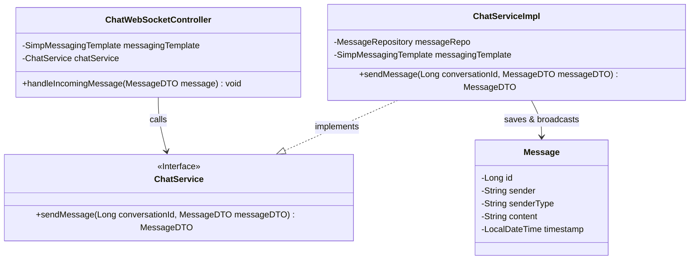

# Class Diagram: Admin Chat with Customer

Mô tả các lớp và phương thức hỗ trợ việc truyền tải tin nhắn từ Admin tới Khách hàng.

```mermaid
classDiagram
    class ChatWebSocketController {
        -SimpMessagingTemplate messagingTemplate
        -ChatService chatService
        +handleIncomingMessage(MessageDTO message) void
    }

    class ChatService {
        <<Interface>>
        +sendMessage(Long conversationId, MessageDTO messageDTO) MessageDTO
    }

    class ChatServiceImpl {
        -MessageRepository messageRepo
        -SimpMessagingTemplate messagingTemplate
        +sendMessage(Long conversationId, MessageDTO messageDTO) MessageDTO
    }

    class Message {
        -Long id
        -String sender
        -String senderType
        -String content
        -LocalDateTime timestamp
    }

    ChatWebSocketController --> ChatService : calls
    ChatServiceImpl ..|> ChatService : implements
    ChatServiceImpl --> Message : saves & broadcasts
```
