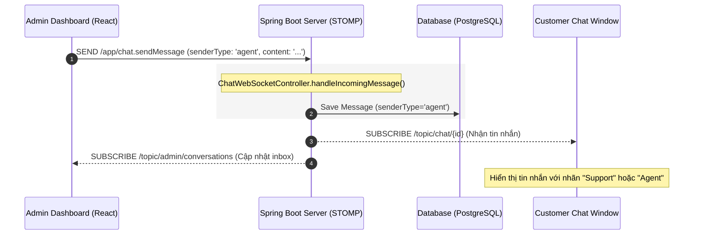

# Sequence Diagram: Admin Chat with Customer

Sơ đồ mô tả luồng một tin nhắn đi từ giao diện Admin tới giao diện Khách hàng.

```mermaid
sequenceDiagram
    autonumber
    participant Admin as Admin Dashboard (React)
    participant Server as Spring Boot Server (STOMP)
    participant DB as Database (PostgreSQL)
    participant Customer as Customer Chat Window

    Admin->>Server: SEND /app/chat.sendMessage (senderType: 'agent', content: '...')
    
    rect rgb(245, 245, 245)
    Note over Server: ChatWebSocketController.handleIncomingMessage()
    Server->>DB: Save Message (senderType='agent')
    end

    Server-->>Customer: SUBSCRIBE /topic/chat/{id} (Nhận tin nhắn)
    Server-->>Admin: SUBSCRIBE /topic/admin/conversations (Cập nhật inbox)

    Note over Customer: Hiển thị tin nhắn với nhãn "Support" hoặc "Agent"
```
