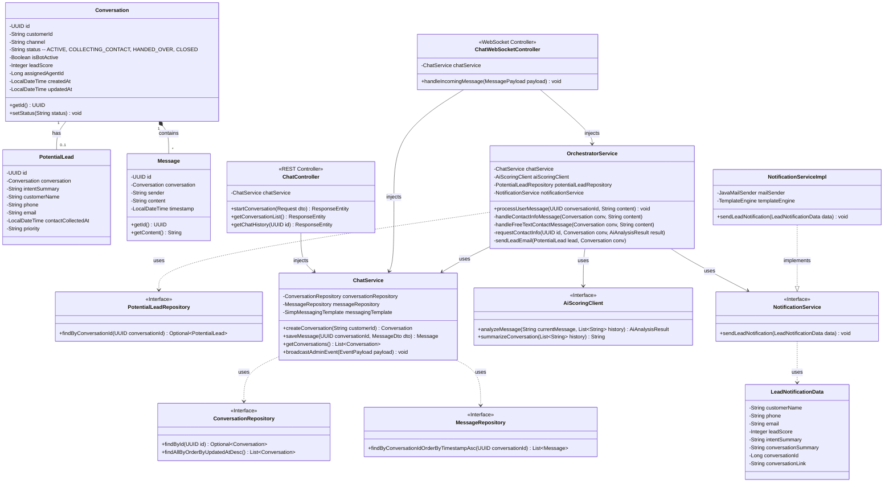

# Class Diagram: Chat Module

Tài liệu này mô tả cấu trúc các lớp (Class Diagram) cơ bản của tính năng Chat trong backend (Spring Boot). Sơ đồ thể hiện mối quan hệ giữa các Entities, Repositories, Service và Controllers.

## Biểu Đồ Lớp (Class Diagram)

## Chú Thích Các Thành Phần

1. **Entities (`Conversation`, `Message`)**:
   - Chịu trách nhiệm ánh xạ (ORM) với các bảng trong cơ sở dữ liệu PostgreSQL.
   - Một hội thoại (`Conversation`) có thể có nhiều tin nhắn (`Message`) theo quan hệ `One-to-Many`.

2. **Repositories (`ConversationRepository`, `MessageRepository`)**:
   - Kế thừa từ `JpaRepository`.
   - Cung cấp các phương thức truy vấn DB (ví dụ lấy danh sách hội thoại sắp xếp theo thời gian mới nhất, hoặc lấy tin nhắn theo `conversationId`).

3. **`ChatService` (Khối Logic Cốt Lõi)**:
   - Nhận yêu cầu từ cả REST API và WebSocket.
   - Thao tác với Repositories để lưu trữ/đọc dữ liệu.
   - Sử dụng `SimpMessagingTemplate` để đẩy thông điệp realtime (chẳng hạn như `broadcastAdminEvent` cho Dashboard Admin).

4. **Controllers (`ChatController`, `ChatWebSocketController`)**:
   - `ChatController`: Là REST API truyền thống, dùng cho các thao tác như tạo phòng lúc đầu, hoặc admin kéo lịch sử hội thoại khi mới mở trang.
   - `ChatWebSocketController`: Xử lý các luồng thông điệp đến qua kênh `/app/...` (MessageMapping).

5. **`WebSocketConfig`**: Cấu hình cơ sở cho STOMP/SockJS, định nghĩa các endpoint và message broker routing (ví dụ: `/topic`).

6. **Clients (`AdminClient`, `CustomerClient`)**:
   - Tượng trưng cho giao diện phía Frontend (React). Giao tiếp với backend qua HTTP REST để lấy dữ liệu tĩnh (như lịch sử), và qua WebSocket STOMP để truyền nhận tin nhắn/sự kiện realtime.
