# Class Diagram: Chat Module

Tài liệu này mô tả cấu trúc các lớp (Class Diagram) cơ bản của tính năng Chat trong backend (Spring Boot). Sơ đồ thể hiện mối quan hệ giữa các Entities, Repositories, Service và Controllers, bao gồm cả tích hợp đa kênh (Facebook Messenger).

## Biểu Đồ Lớp (Class Diagram)

```mermaid
classDiagram
    %% Định nghĩa các Entities
    class Conversation {
        -Long id
        -String customerId
        -String channel
        -String status -- ACTIVE, COLLECTING_CONTACT, HANDED_OVER, CLOSED
        -Boolean isBotActive
        -Integer leadScore
        -Integer unreadCount
        -Long assignedAgentId
        -LocalDateTime createdAt
        -LocalDateTime updatedAt
        +getId() Long
        +setStatus(String status) void
        +incrementUnreadCount() void
        +resetUnreadCount() void
    }

    class PotentialLead {
        -Long id
        -Conversation conversation
        -String intentSummary
        -String customerName
        -String phone
        -String email
        -Boolean isLeadNotified
        -LocalDateTime contactCollectedAt
        -String priority
    }

    class Message {
        -Long id
        -Conversation conversation
        -String sender
        -String content
        -LocalDateTime timestamp
        +getId() Long
        +getContent() String
    }

    %% Định nghĩa Repositories
    class ConversationRepository {
        <<Interface>>
        +findById(Long id) Optional~Conversation~
        +findByCustomerId(String customerId) Optional~Conversation~
        +findAllByOrderByUpdatedAtDesc() List~Conversation~
    }

    class MessageRepository {
        <<Interface>>
        +findByConversationIdOrderByTimestampAsc(Long conversationId) List~Message~
    }

    class PotentialLeadRepository {
        <<Interface>>
        +findByConversationId(Long conversationId) Optional~PotentialLead~
    }

    %% Định nghĩa Service
    class ChatService {
        <<Interface>>
        +createConversation(String customerId, String channel) Conversation
        +sendMessage(Long conversationId, MessageDTO dto) MessageDTO
        +getConversationHistory(Long conversationId) List~MessageDTO~
        +markAsRead(Long conversationId) void
    }

    class ChatServiceImpl {
        -ConversationRepository conversationRepository
        -MessageRepository messageRepository
        -SimpMessagingTemplate messagingTemplate
        +markAsRead(Long conversationId) void
    }

    class MessengerService {
        -String pageAccessToken
        +sendMessage(String recipientId, String text) void
        +getUserProfile(String psid) Map~String, String~
    }

    class OrchestratorService {
        <<Interface>>
        +processUserMessage(Long conversationId, String content) void
    }

    class OrchestratorServiceImpl {
        -ChatService chatService
        -AiScoringClient aiScoringClient
        -PotentialLeadRepository potentialLeadRepository
        -NotificationService notificationService
        +processUserMessage(Long conversationId, String content) void
    }

    class AiScoringClient {
        <<Interface>>
        +analyzeMessage(String currentMessage, List~String~ history) AiAnalysisResult
        +summarizeConversation(List~String~ history) String
    }

    class NotificationService {
        <<Interface>>
        +sendLeadNotification(LeadNotificationData data) void
    }

    %% Định nghĩa Controllers
    class ChatController {
        <<REST Controller>>
        -ChatService chatService
        +getConversation(Long id) ResponseEntity
        +markAsRead(Long id) ResponseEntity
    }

    class ChatWebSocketController {
        <<WebSocket Controller>>
        -ChatService chatService
        -OrchestratorService orchestratorService
        +handleIncomingMessage(MessagePayload payload) void
    }

    class MessengerWebhookController {
        <<REST Controller>>
        -MessengerService messengerService
        -ChatService chatService
        -OrchestratorService orchestratorService
        +handleWebhook(String body, String signature) ResponseEntity
    }

    %% Thiết lập các mối quan hệ (Relationships)
    Conversation "1" *-- "*" Message : contains
    Conversation "1" -- "0..1" PotentialLead : has
    
    ChatServiceImpl ..|> ChatService : implements
    ChatServiceImpl --> ConversationRepository : uses
    ChatServiceImpl --> MessageRepository : uses
    
    OrchestratorServiceImpl ..|> OrchestratorService : implements
    OrchestratorServiceImpl --> ChatService : uses
    OrchestratorServiceImpl --> AiScoringClient : uses
    OrchestratorServiceImpl --> NotificationService : uses
    
    ChatController --> ChatService : injects
    ChatWebSocketController --> ChatService : injects
    ChatWebSocketController --> OrchestratorService : injects
    
    MessengerWebhookController --> MessengerService : injects
    MessengerWebhookController --> ChatService : injects
    MessengerWebhookController --> OrchestratorService : injects
```

## Chú Thích Các Thành Phần Mới

1. **Đa kênh (Omnichannel)**:
   - `MessengerWebhookController` & `MessengerService`: Tiếp nhận và xử lý tin nhắn từ Facebook Messenger Page. Tự động lấy profile khách hàng để cá nhân hóa.
   - `channel`: Thuộc tính trong `Conversation` để phân biệt nguồn (Web/Facebook).

2. **Quản lý trạng thái xem (Read State)**:
   - `unreadCount`: Đếm số tin nhắn chưa đọc từ khách hàng.
   - `markAsRead()`: Phương thức trong `ChatService` để reset số đếm khi nhân viên hỗ trợ mở hội thoại.

3. **Lead Notification Fix**:
   - `isLeadNotified`: Cờ trong `PotentialLead` đảm bảo hệ thống chỉ gửi 1 email duy nhất cho mỗi khách hàng tiềm năng, tránh spam hộp thư nhân viên.
