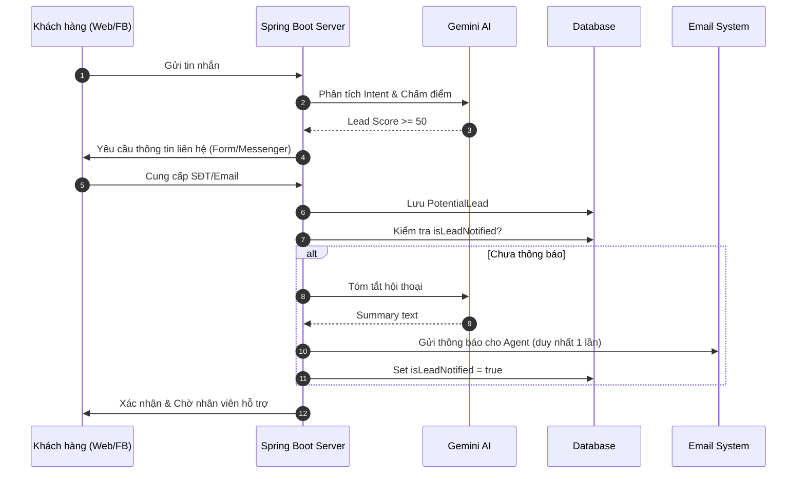

# Sequence Diagram: Omnichannel & Admin Realtime

Tài liệu này mô tả luồng hoạt động (sequence) của hệ thống khi tiếp nhận tin nhắn từ nhiều nguồn (Website, Facebook) và cách Admin Dashboard cập nhật trạng thái tin nhắn chưa đọc.

## 1. Luồng Tin Nhắn Facebook Messenger

```mermaid
sequenceDiagram
    autonumber
    
    participant FB as Facebook Messenger
    participant Webhook as MessengerWebhookController
    participant MS as MessengerService
    participant CS as ChatService
    participant OS as OrchestratorService
    participant WS as WebSocket Broker
    participant Admin as Admin Dashboard (React)

    FB->>Webhook: Gửi tin nhắn (Webhook Event)
    Webhook->>MS: getUserProfile(psid)
    MS-->>Webhook: Trả về Tên khách hàng
    Webhook->>CS: createConversation (nếu chưa có)
    Webhook->>CS: sendMessage(content, senderType='user')
    
    rect rgb(30, 30, 30)
    Note right of CS: Logic Unread Count
    CS->>CS: Increment unreadCount
    CS->>WS: Broadcast CONVERSATION_UPDATED
    WS-->>Admin: Hiển thị badge số tin mới
    end

    Webhook->>OS: processUserMessage()
    OS->>CS: sendBotReply(reply)
    CS->>MS: sendMessage (FB Send API)
    MS-->>FB: Trả về tin nhắn của Bot
```

## 2. Luồng Đọc Tin Nhắn (Admin Mark As Read)

```mermaid
sequenceDiagram
    autonumber
    
    participant Admin as Admin Dashboard (React)
    participant CC as ChatController
    participant CS as ChatService
    participant WS as WebSocket Broker

    Admin->>Admin: Click chọn hội thoại
    Admin->>CC: POST /api/conversations/{id}/read
    CC->>CS: markAsRead(id)
    
    rect rgb(30, 30, 30)
    Note right of CS: Logic Reset
    CS->>CS: Set unreadCount = 0
    CS->>WS: Broadcast CONVERSATION_UPDATED
    WS-->>Admin: Xóa badge số tin chưa đọc
    end
```

## 3. Luồng AI Orchestrator & Handover (Tổng quát)

## Chú Thích
1. **Messenger Integration**: Sử dụng Webhook để nhận tin và Send API để phản hồi. Tự động mapping profile người dùng vào hệ thống.
2. **Unread Management**: Số tin nhắn chưa đọc được quản lý tại server và đồng bộ qua WebSocket ngay lập tức.
3. **Session Persistence**: Chat Widget trên web sử dụng `sessionStorage` để không làm đứt quãng hội thoại khi refresh.
