# Sequence Diagram: Push Realtime cho Admin Dashboard

Tài liệu này mô tả luồng hoạt động (sequence) của tính năng đẩy dữ liệu (push) realtime cho Admin Dashboard thông qua kênh WebSocket. Việc này thay thế giải pháp polling, giúp Admin theo dõi các cuộc hội thoại và tin nhắn mới ngay lập tức.

## Biểu Đồ Tuần Tự (Sequence Diagram)

```mermaid
sequenceDiagram
    autonumber
    
    participant AdminClient as AdminClient (React)
    participant CustomerClient as CustomerClient (React)
    participant ChatController as ChatController
    participant ChatWebSocketController as ChatWebSocketController
    participant ChatService as ChatService
    participant OrchestratorService as OrchestratorService
    participant AiScoringClient as AiScoringClient
    participant Repositories as Conversation/Message/Lead<br/>Repositories
    participant NotificationService as NotificationService
    participant SimpMessagingTemplate as SimpMessagingTemplate
    participant WSBroker as WebSocket Broker

    %% Giai đoạn 1: Admin Khởi tạo kết nối
    rect rgb(0, 0, 0)
    Note over AdminClient, WSBroker: 1. Khởi tạo kết nối & Subscribe Topic
    AdminClient->>WSBroker: Connect WebSocket STOMP (/ws)
    WSBroker-->>AdminClient: Connected
    AdminClient->>WSBroker: subscribeToAdminTopic()<br/>-> /topic/admin/conversations
    end

    %% Giai đoạn 2: Khách hàng Tương tác & AI Xử lý
    rect rgb(0, 0, 0)
    Note over CustomerClient, Repositories: 2. Luồng tin nhắn & AI Orchestrator
    
    CustomerClient->>ChatWebSocketController: sendMessage()
    ChatWebSocketController->>ChatService: saveMessage(dto)
    ChatService->>Repositories: save(Message)
    
    ChatWebSocketController->>OrchestratorService: processUserMessage()
    
    alt Luồng thông tin liên hệ ([CONTACT] prefix)
        OrchestratorService->>Repositories: Save Contact Info to PotentialLead
        OrchestratorService->>ChatService: updateStatus(HANDED_OVER) & disableBot()
        OrchestratorService->>AiScoringClient: summarizeConversation(history)
        AiScoringClient-->>OrchestratorService: summary text
        OrchestratorService->>NotificationService: sendLeadNotification(data + summary)
        NotificationService-->>Admin (Email): Lead Alert Email
        OrchestratorService->>ChatService: sendBotReply("Cảm ơn...")
    else Luồng AI bình thường
        OrchestratorService->>AiScoringClient: analyzeMessage(msg, history)
        AiScoringClient-->>OrchestratorService: AiAnalysisResult
        OrchestratorService->>Repositories: Update Lead Score
        
        alt Nếu Score >= 50 hoặc Intent == Handover
            OrchestratorService->>ChatService: updateStatus(COLLECTING_CONTACT)
            OrchestratorService->>ChatService: sendMessage(type="collect_contact")
            ChatService->>WSBroker: push to /topic/chat/{id}
            WSBroker->>CustomerClient: Hiển thị Mini Contact Form
        else Bot trả lời bình thường
            OrchestratorService->>ChatService: sendBotReply(reply)
        end
    end
    end
    
    %% Giai đoạn 3: Push Notification Realtime cho Admin
    rect rgb(0, 0, 0)
    Note over ChatService, AdminClient: 3. Đẩy sự kiện Realtime tới Admin Dashboard
    ChatService->>SimpMessagingTemplate: broadcastAdminEvent(EventPayload)
    SimpMessagingTemplate->>WSBroker: send to /topic/admin/conversations
    WSBroker->>AdminClient: Broadcast (LEAD_SCORE_UPDATED, etc.)
    AdminClient->>AdminClient: Update Inbox State & Tabs
    end
```

## Chú Thích Các Bước

1. **Khởi tạo kết nối Admin (`AdminClient`)**: Khi Admin vào màn hình `/admin`, giao diện React ngay lập tức tạo kết nối STOMP qua WebSocket Broker và gọi `subscribeToAdminTopic()` để đăng ký lắng nghe tại topic `/topic/admin/conversations`.
2. **Khách hàng tương tác (`CustomerClient`)**: Tùy vào hành động cụ thể, giao diện khách hàng sẽ gọi `ChatController` qua HTTP REST (khi khởi tạo hội thoại mới) hoặc thông qua `ChatWebSocketController` (khi gửi tin nhắn realtime). Từ đó, `ChatService` sẽ điều phối luồng và gọi Repositories (`ConversationRepository`, `MessageRepository`) để lưu CSDL.
3. **Push Event Realtime (`ChatService`)**: Đây là logic cốt lõi. Sau khi dữ liệu được lưu thành công, `ChatService` sẽ gọi tới hàm `broadcastAdminEvent()`, bản chất là truyền qua `SimpMessagingTemplate` để bắn một thông điệp Broadcast.
4. **Cập nhật UI (`AdminClient`)**: WebSocket Broker phân phối tin nhắn dạng JSON Event cho AdminClient. Frontend lập tức gọi hàm `renderConversations()` để tự động cập nhật State (đưa hội thoại lên top, thêm tin nhắn), hiển thị trực tiếp mà không cần chờ chu kỳ lấy dữ liệu (polling) tiếp theo.
