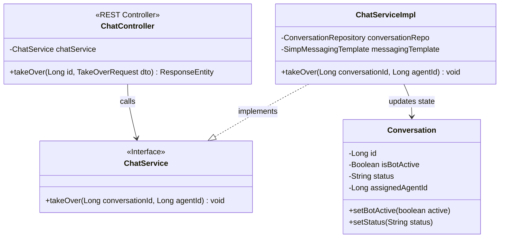

# Class Diagram: Handover/Take Over

Sơ đồ lớp mô tả các thành phần tham gia vào luồng giành quyền hỗ trợ.

```mermaid
classDiagram
    class ChatController {
        <<REST Controller>>
        -ChatService chatService
        +takeOver(Long id, TakeOverRequest dto) ResponseEntity
    }

    class ChatService {
        <<Interface>>
        +takeOver(Long conversationId, Long agentId) void
    }

    class ChatServiceImpl {
        -ConversationRepository conversationRepo
        -SimpMessagingTemplate messagingTemplate
        +takeOver(Long conversationId, Long agentId) void
    }

    class Conversation {
        -Long id
        -Boolean isBotActive
        -String status
        -Long assignedAgentId
        +setBotActive(boolean active)
        +setStatus(String status)
    }

    ChatController --> ChatService : calls
    ChatServiceImpl ..|> ChatService : implements
    ChatServiceImpl --> Conversation : updates state
```
