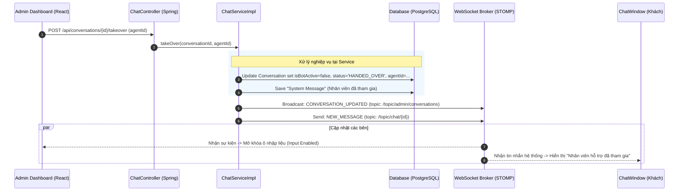

# Sequence Diagram: Handover/Take Over

Sơ đồ tuần tự mô tả luồng dữ liệu khi Admin thực hiện giành quyền từ Bot.

```mermaid
sequenceDiagram
    autonumber
    participant Admin as Admin Dashboard (React)
    participant API as ChatController (Spring)
    participant Service as ChatServiceImpl
    participant DB as Database (PostgreSQL)
    participant STOMP as WebSocket Broker (STOMP)
    participant Customer as ChatWindow (Khách)

    Admin->>API: POST /api/conversations/{id}/takeover (agentId)
    API->>Service: takeOver(conversationId, agentId)
    
    rect rgb(240, 248, 255)
    Note over Service, DB: Xử lý nghiệp vụ tại Service
    Service->>DB: Update Conversation set isBotActive=false, status='HANDED_OVER', agentId=...
    Service->>DB: Save "System Message" (Nhân viên đã tham gia)
    end

    Service->>STOMP: Broadcast: CONVERSATION_UPDATED (topic: /topic/admin/conversations)
    Service->>STOMP: Send: NEW_MESSAGE (topic: /topic/chat/{id})

    par Cập nhật các bên
        STOMP-->>Admin: Nhận sự kiện -> Mở khóa ô nhập liệu (Input Enabled)
        STOMP-->>Customer: Nhận tin nhắn hệ thống -> Hiển thị "Nhân viên hỗ trợ đã tham gia"
    end
```
