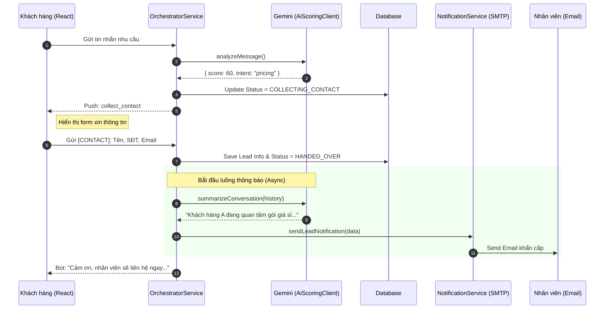

# Sequence Diagram: Lead Capture & Notification

Sơ đồ mô tả luồng tự động từ khi AI phát hiện khách tiềm năng cho đến khi nhân viên nhận được Email.

```mermaid
sequenceDiagram
    autonumber
    
    participant Customer as Khách hàng (React)
    participant Orchestrator as OrchestratorService
    participant AI as Gemini (AiScoringClient)
    participant DB as Database
    participant Mail as NotificationService (SMTP)
    participant Agent as Nhân viên (Email)

    %% Trigger
    Customer->>Orchestrator: Gửi tin nhắn nhu cầu
    Orchestrator->>AI: analyzeMessage()
    AI-->>Orchestrator: { score: 60, intent: "pricing" }
    
    %% Request Contact
    Orchestrator->>DB: Update Status = COLLECTING_CONTACT
    Orchestrator-->>Customer: Push: collect_contact
    Note right of Customer: Hiển thị form xin thông tin

    %% Collect Contact
    Customer->>Orchestrator: Gửi [CONTACT]: Tên, SĐT, Email
    Orchestrator->>DB: Save Lead Info & Status = HANDED_OVER
    
    %% Summary & Notify
    rect rgb(240, 255, 240)
    Note over Orchestrator, AI: Bắt đầu luồng thông báo (Async)
    Orchestrator->>AI: summarizeConversation(history)
    AI-->>Orchestrator: "Khách hàng A đang quan tâm gói giá sỉ..."
    Orchestrator->>Mail: sendLeadNotification(data)
    Mail->>Agent: Send Email khẩn cấp
    end

    Orchestrator-->>Customer: Bot: "Cảm ơn, nhân viên sẽ liên hệ ngay..."
```
