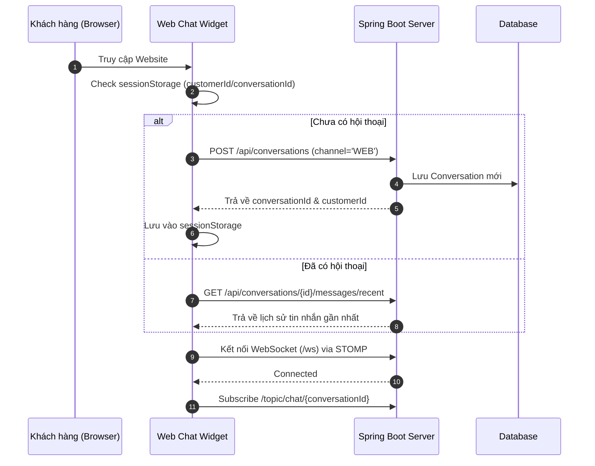
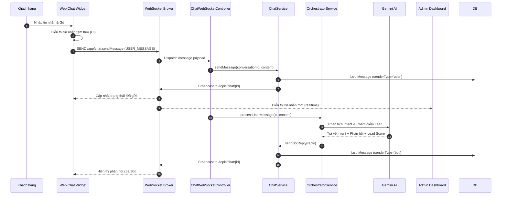
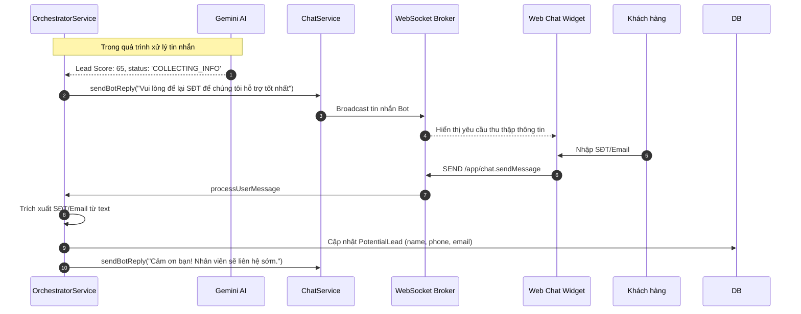
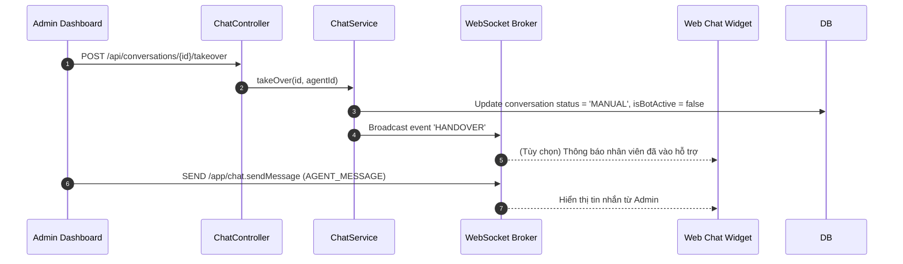

# Sequence Diagram: Web Channel Flow

Tài liệu này mô tả chi tiết luồng hoạt động (sequence) của kênh Web (Chat Widget) từ lúc khởi tạo đến khi thu thập thông tin khách hàng (Lead) và tương tác với Admin.

## 1. Khởi tạo kết nối (Connection & Handshake)

Khi khách hàng truy cập website, Widget sẽ kiểm tra Session và thiết lập kết nối realtime.

## 2. Luồng gửi tin nhắn & AI Phản hồi (Messaging Flow)

Mô tả cách tin nhắn được truyền tải realtime qua WebSocket và được AI xử lý.

## 3. Luồng Thu thập thông tin (Lead Capture Flow)

Khi AI nhận diện khách hàng tiềm năng (Score >= 50), hệ thống sẽ yêu cầu thông tin liên hệ.

## 4. Admin Tiếp quản (Handover)

Khi Admin muốn can thiệp vào cuộc trò chuyện.

## Ghi chú kỹ thuật
1. **WebSocket Protocol**: Sử dụng STOMP trên nền tảng WebSocket tiêu chuẩn.
2. **Persistence**: Lịch sử tin nhắn luôn được lưu vào Database trước khi broadcast.
3. **Typing Indicator**: Widget gửi event `TYPING_INDICATOR` lên `/app/chat.sendMessage` để Admin biết khách đang soạn tin.
